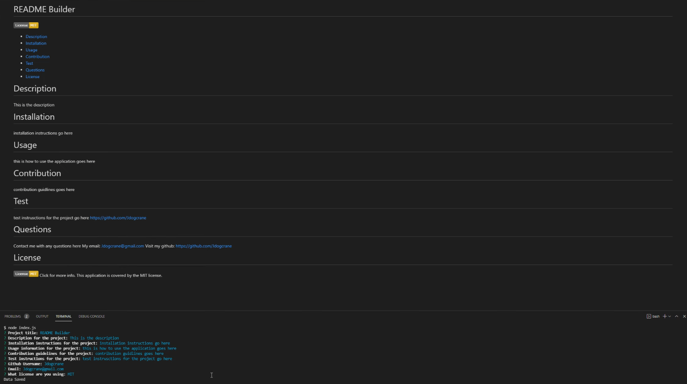

<h1 style="text-align: center;">README Builder</h1>

[[Demo-Video]](https://youtu.be/50X8TfsBtOc)

[[Preview]](#Preview)

## General overview: 

 
For this project my goal was to create a simple readme using Node.js & JavaScript. I used inquirer and fs to create the readme. Using prompts in the terminal you can build a functional README document. After filling out the prompts the script will take in user inputs and drop them in the string of the readme template using jQuery. Once compleate the user will be given a notice that the data was saved.

<h3 style="text-align:center;">Instructions</h3>

1. Initialize the app in the terminal using: `node index.js`
2. Once complete fill out the prompts presented
3. After the prompts are filled and terminal logs `Data Saved` your file will be created!
4. Review and enjoy your newly custom built README!

<h3 style="text-align:center;">JS-Summary</h3>

* Added Packages needed for the application
* Added function that prevents user from leaving input empty
* Added prompts in terminal for the user to input data for the app to collect
* Added function that collects data from each input
* Added if statements that create license badge based depending on which one the user picks
* Added basic template that gets filled dynamically based off user input
* Added function that writes a new readme file using the new update template

>Notes: Did not try to do modules, but I plan on doing it in the future. Pretty happy with how it turned out tho :)

## Preview
